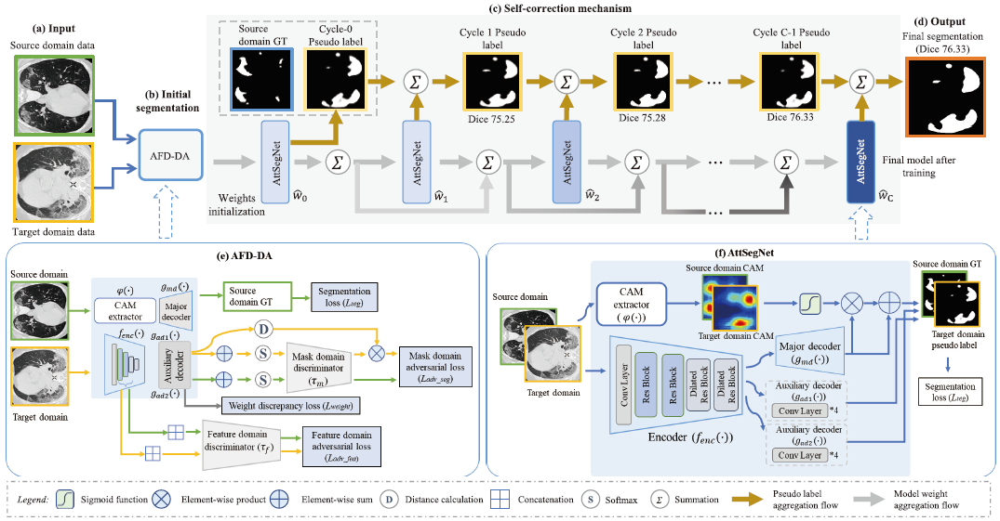
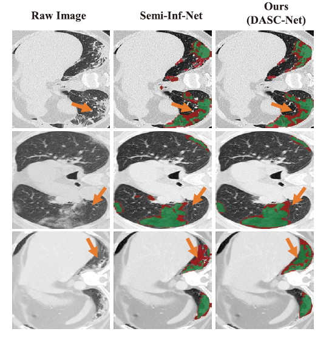
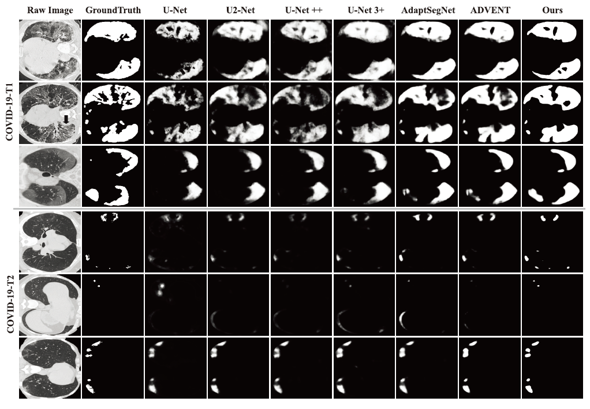
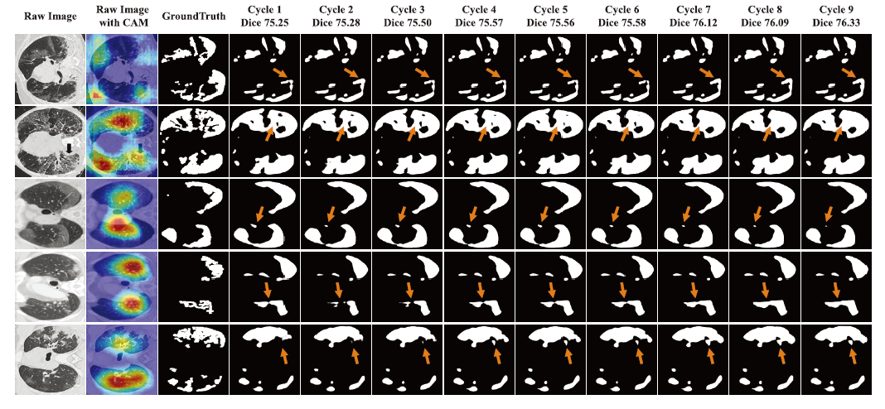

### DASC_COVID19

**Domain adaptation based self-correction model for COVID-19 infection segmentation in CT images**(https://doi.org) accepted by Expert Systems with Applications

by [Qiangguo Jin](https://qgking.github.io/), [Hui Cui](https://hcui7511.github.io/), [Changming Sun](https://vision-cdc.csiro.au/changming.sun/), [Zhaopeng Meng](http://cic.tju.edu.cn/info/1170/2451.htm), [Leyi Wei](http://lab.malab.cn/~wly/), [Ran Su](http://www.escience.cn/people/suran/index.html). 

### Example results  

- Overview of the proposed DASC-Net for COVID-19 CT segmentation.


- Three examples of COVID-19 infection segmentation against Semi-Inf-Net. The segmentation results from Semi-Inf-Net were downloaded
from the authors' GitHub repository(https://github.com/DengPingFan/Inf-Net) . The false predictions, i.e., false-positive and false-negative, are shown in red while the correct predictions are in green. The significant improvement by our model is marked with orange arrows.
- 

- Visual comparison of COVID-19 infection segmentation against other methods on two target datasets.
- 

- Illustration of segmentation map in 9 cycles on COVID-19-T1. The refinement is marked with orange arrows.


### Dataset
[CIR](https://github.com/JunMa11/COVID-19-CT-Seg-Benchmark),[ISMIR](http://medicalsegmentation.com/covid19/),[MOSMEDDATA](https://mosmed.ai/datasets/covid19_1110)

### Usage

 - [x] Releasing main code
 - [ ] Detailed usage instruction

## Citation

If the code is helpful for your research, please consider citing:

  ```shell
  @article{JINDASC2021,
    title = "Domain adaptation based self-correction model for COVID-19 infection segmentation in CT images",
    author = "Qiangguo Jin, Hui Cui, Changming Sun, Zhaopeng Meng, Leyi Wei, and Ran Su",
    journal = "Expert Systems with Applications",
    year = "2021",
  }

  ```


### Questions

General questions, please contact 'qgking@tju.edu.cn'
